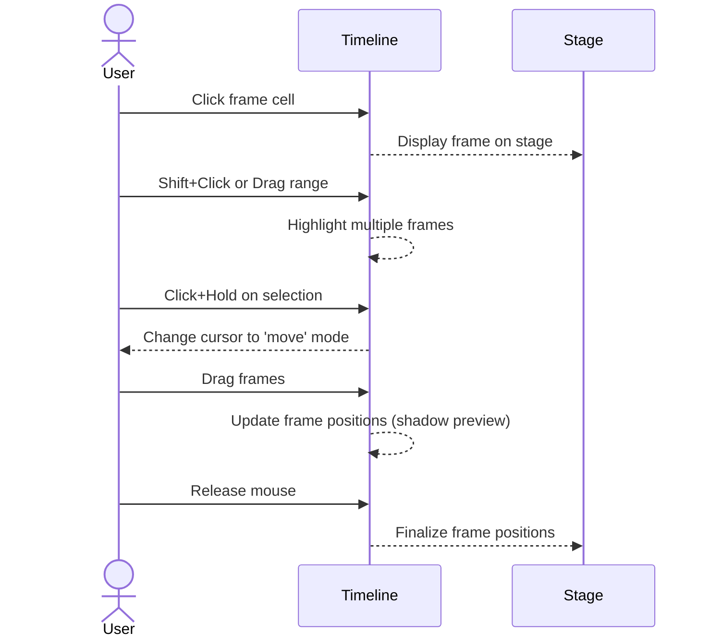

# Mouse Interaction Design Specification (Canvas and Timeline)

**Executive Summary:** This report defines a comprehensive set of mouse interactions for a next-generation Adobe Animate MVP, covering both the canvas and timeline editors. We analyze selection models (single, multi, lasso, marquee) and object manipulation (move, scale, rotate, skew) on the canvas, and frame/keyframe operations (select, drag, copy, stretch, insert/delete) in the timeline. Each interaction (left/right/double-click, drag, hover, wheel, with Shift/Ctrl/Alt modifiers) is specified in detail. We discuss snapping (to grid/guides), Z-order and grouping behaviors, drag‑and‑drop asset import, and context menus. Accessibility is addressed by recommending keyboard alternatives, focus and tooltip cues. Edge cases (overlapping objects, simultaneous canvas/timeline actions) are noted. Visual feedback (cursor changes, highlights, tooltips, animations) and micro-interaction cues (e.g. subtle glows) are included. Comparative tables summarize behaviors across Animate, After Effects, Toon Boom Harmony, and Figma. Finally, mermaid diagrams illustrate selection flow logic and a sequence diagram for timeline editing.

## Canvas Interactions

### Selection Models  
- **Single-click:** Click on an object’s stroke, fill, group, or instance to select it【41†L253-L259】. The object is highlighted (typically with a bounding box or marquee) upon selection【41†L253-L259】. If multiple items overlap, the topmost item under the cursor is selected by default.  
- **Multi-select (Shift/Ctrl/Cmd):** Hold **Shift** while clicking to add additional objects to the selection【41†L261-L264】. In Animate, **Shift** adds to selection; in some modes **Ctrl**/**Command** may similarly toggle individual items【36†L264-L270】. Figma also uses Shift-click to toggle items in a multi-selection.  
- **Marquee (Box) selection:** Click on empty canvas and drag to draw a rectangular selection box. Any object (or stroke) that intersects the box becomes selected【41†L253-L259】【48†L180-L188】. In both Animate and FigJam, a drag-box selects all touched objects (with a colored highlight shown)【41†L253-L259】【48†L180-L188】. Holding **Shift** during a box selection typically adds to the existing selection. Locked objects are ignored.  
- **Lasso (Freeform) selection:** If provided (Animate has a Lasso tool【41†L200-L204】), click-drag an irregular path to select any enclosed objects or partial shapes【41†L200-L204】. The polygon/Freehand lasso allows fine-grained selection of complex shapes. (If no lasso tool is implemented, this can be omitted or disabled.)  

In summary, canvas selection should support click-select, shift-add, control-select for discontiguous picks, and click‑drag box selection【41†L253-L259】【48†L180-L188】. The UI should visibly highlight selected objects (e.g. a bounding box or translucent marquee【41†L253-L259】).

### Object Manipulation (Move, Scale, Rotate, Skew)  
- **Move:** With the Selection or Move tool active, click on a selected object (within its bounding box) and drag to reposition【46†L249-L252】. The cursor typically shows a move icon when over a moveable area (inside the bounding box)【65†L244-L245】.  
- **Scale (Resize):** Click a corner or edge handle of the bounding box and drag. Corner handles scale in two dimensions; side handles scale in one dimension. Holding **Shift** constrains proportions (uniform scale)【46†L263-L264】. (Animate’s Free Transform uses corner handles for scale with Shift for uniform scaling【46†L263-L264】.)  
- **Rotate:** Click just outside a corner handle and drag to rotate around the pivot point【46†L256-L258】. The cursor changes (rotational icon) when outside a handle【65†L244-L245】. Dragging a corner rotates freely; **Shift-drag** constrains to 45° increments【46†L256-L258】. Holding **Alt/Option** while dragging rotates around the opposite corner or flips the pivot side【46†L259-L262】.  
- **Skew:** Click-and-drag a side-middle handle (edge midpoints) to skew the object along one axis【46†L269-L270】. The pointer changes to a skew cursor. Holding **Ctrl/Cmd** while dragging a handle may enter a freeform distort mode (per Animate’s Distort command)【46†L272-L273】.  
- **Transform Origin (Pivot):** A transform point is shown (initially at object’s center【44†L180-L184】). The user can **drag this pivot point** to a new origin【46†L253-L254】, or double-click it to recenter on the object. Alt/Option-dragging a transform handle will use the opposite corner as pivot【46†L259-L262】. After-effects style pivot move (drag transform widget) should be implemented【46†L253-L254】.  

These behaviors are consistent with Animate’s Free Transform tool (which displays a bounding box and handles【44†L180-L184】). See Figure 1 for transform handle mapping (corner=scale/rotate, edge=skew). The canvas should update in real-time during drag, and show an object outline or ghost during transformation.  

### Snapping and Alignment Guides  
- **Guides/Grid:** Provide horizontal/vertical guides and a visible grid (under View menu). Users can toggle “Snap to Guides” or “Snap to Grid”【54†L433-L442】【54†L487-L490】. When dragging an object near a guide or grid line, it snaps into alignment. Guides should default to a distinct color (e.g. green) and can be moved by dragging from rulers【54†L439-L444】.  
- **Smart Guides:** When moving objects, on-screen alignment hints (lines or highlights) should appear to indicate edges/centers aligning with other objects. (Figma’s “magnetic” alignment lines are a model.)  
- **Alignment Tools:** Provide toolbar or context-menu options to align/distribute selected objects (e.g. Align Left, Center, etc.). Figma’s alignment toolbar is an example【48†L223-L231】.  
- **Spacing/Tidy:** If multiple objects are selected and a “Tidy Up” or spacing mode is invoked, show inter-object spacing handles (pink lines/dots in Figma) to adjust spacing【48†L264-L273】.  

Snapping priority: snap-to-guides > snap-to-grid. Guides and grid can be locked to avoid accidental move【54†L433-L442】. 

### Z-Order and Grouping  
- **Z-Order (Stacking):** Provide commands to change object stacking order. For example: “Bring Forward/Backward” and “Bring to Front/Back.” Figma uses a right-click menu with these options【48†L308-L317】. Likewise, right-clicking an object could show *Bring Forward/Back* options【48†L308-L317】. Animate traditionally uses Modify→Arrange commands. The UI could also show keyboard shortcuts (e.g. Ctrl+[, Ctrl+] in Figma style【48†L330-L339】).  
- **Grouping/Ungrouping:** Allow grouping of objects so they can be manipulated as one. Selecting any object in a group selects the entire group【41†L224-L228】. Provide a “Group” and “Ungroup” context menu or toolbar button (e.g. Modify→Group). (Animate’s docs note grouping for single manipulation【41†L224-L228】.) Locked groups should not be selectable or editable.  
- **Lock/Hide Layers:** In a layers panel, clicking a lock or eye icon toggles editability and visibility. (Right-click layer → Lock All, etc. in Animate.) If not present, at least allow clicking icons in layer list to lock/hide.  

When objects overlap, clicking typically selects the uppermost; consider a “Select underlying” if needed (e.g. successive Ctrl+clicks to cycle, or a context “Select Next Object”). In the absence of a standard, the simplest rule is topmost-only selection.

### Copy/Paste and Asset Panel Drag‑and‑Drop  
- **Duplicate by Drag:** Implement **Alt/Option+Drag** on canvas objects to duplicate (as in Animate’s timeline【36†L336-L342】 and Figma). When dragging with Alt held, the object is cloned at the drop location.  
- **Copy/Paste:** Support Copy/Paste via menu or keyboard. Right-click on object(s) and choose Copy/Paste to duplicate. After pasting, new objects should appear aligned to original by default.  
- **Asset Panel Drag:** Dragging an asset (symbol, image, shape) from the Assets panel onto the stage creates an instance【50†L175-L177】. This should work as a direct mouse-drop action (no intermediate step).  

### Context Menus (Canvas)  
- **Right-Click on Object:** Show a context menu relevant to the selection. Typical options: Group/Ungroup, Cut/Copy/Paste, Order (Bring to Front/Back), Convert to Symbol, Properties, etc. For example, right-clicking a shape might offer *Arrange→Bring Forward*【48†L308-L317】 or *Properties*. Animate’s layer context shows *Properties*【2†L361-L364】; similarly, a canvas context can show *Properties*.  
- **Right-Click on Empty Canvas:** Show general options: Paste, Stage Properties, Insert Symbol, etc. Could include toggles for guides, snapping, or UI focus.  

Context menu choices should match those available in menu bars/toolbar but grouped by relevance.

### Hover & Tooltip Feedback  
- **Tooltips:** Hovering over toolbar icons or tool buttons should display a tooltip with the command name and shortcut (as in most Adobe UIs). For example, Animate/After Effects show tooltips on hover【65†L244-L245】. Similarly, hover over timeline icons (keyframe, frame) can show “Insert Keyframe” etc.  
- **Highlight & Cursor:** Hovering over an object or handle should update the cursor icon (e.g. arrow, move, rotate, resize)【65†L244-L245】. When an object is selected, its bounding box and handles should be visible, and hovering a handle could briefly highlight that handle.  
- **Value Hints:** If hovering over numeric controls or keyframe points, consider showing current values. For instance, After Effects shows a keyframe’s time/value on hover【64†L267-L270】. We can mimic this: e.g. hovering a transform handle might show scale/rotation values near the cursor.  
- **Contextual Help:** A small status bar or hover label could describe the active tool. 

### Mouse Wheel & Middle-Click  
- **Canvas Zoom:** Often, **Ctrl/Cmd + mouse wheel** zooms the canvas in/out. (If not implemented, middle-click-drag or pinch gestures could pan.) Animate’s timeline doc implies spacebar+tool for timeline, but canvas zoom could follow common convention (Ctrl+Wheel).  
- **Timeline Scroll:** In the timeline, the wheel may scroll vertically through layers or, with Shift, scroll horizontally in time. Alternatively, middle-click or spacebar+drag pans the timeline (see below).  

(Exact behavior can be tuned; ensure consistency with platform conventions.)

## Timeline/Timeframe Interactions

### Frame and Keyframe Selection  
- **Single Frame/Keyframe:** Click on a frame cell to select a frame span (in frame mode) or click a keyframe icon to select that keyframe【36†L264-L270】【56†L365-L372】. The selected cell or keyframe should highlight (e.g. blue). In Animate, clicking a frame highlights that frame span【36†L264-L270】. In After Effects (layer-bar mode) clicking a keyframe selects it【56†L365-L372】.  
- **Multi-Select (Range):**  
  - **Contiguous (Span):** Click the first frame, then Shift-click the last to select the range【36†L264-L270】. Or click-drag a selection over a continuous set of frames across one or multiple layers【25†L73-L79】【36†L264-L270】. The frames in the span highlight as selected.  
  - **Discontiguous:** Ctrl/Cmd-click additional frames on the same layer or across layers to add to the selection【36†L264-L270】.  
- **Span-Based Mode:** If span-based selection is enabled (Animate’s advanced mode), clicking any frame in a tween span selects the entire span【36†L277-L283】. Shift-click can add multiple spans【36†L277-L283】. (This is optional; MVP may default to frame-based selection.)  

Selected frames/ keyframes should change color (e.g. blue)【25†L61-L64】. (Animate shows keyframes with blue outline when selected【25†L61-L64】; Toon Boom highlights blue and yellow during moves.)  

### Scrubbing and Playhead Dragging  
- **Click to Move Playhead:** Clicking the timeline header or frame numbers instantly moves the playhead (current time indicator) to that frame【38†L416-L420】.  
- **Drag Playhead:** Click and hold the blue playhead and drag left/right to scrub (change current frame)【38†L416-L420】. The stage updates in real time. This matches Animate’s behavior: dragging the playhead moves the current frame【38†L416-L420】.  
- **Space/Scrub Tool:** In Animate 2022+, a “time scrub” tool (hand+clock icon) allows scrubbing by dragging on the stage【38†L565-L572】. Press Space+T to activate and drag horizontally to pan the timeline【38†L565-L572】. This should also be supported to allow intuitive timeline panning.  

### Dragging to Move/Stretch Frames  
- **Move Frames/Keyframes:** First select the frames/keyframes. Then **click+drag** the selection to a new time location【25†L73-L79】【25†L91-L95】. Toon Boom requires a two-click process (click to select, then click-drag to move)【25†L61-L64】; similarly, ensure users understand: select first, then drag. During drag, the selected frames should appear “attached” to the cursor (with e.g. a yellow highlight as in Toon Boom【25†L61-L64】).  
- **Stretch (Extend/Compress):** Click the **end edge** of a selected frame span and drag right (extend) or left (compress)【28†L480-L488】. Animate’s timeline supports span stretching: select a span and drag its right boundary to lengthen/shorten it【28†L480-L488】. Display a real-time multiplier (e.g. x2, x3) as in Animate【28†L480-L488】. This should scale the span’s duration.  

### Copy/Paste and Duplication  
- **Copy/Paste Commands:** Provide Edit→Copy/Paste for frames/keyframes. The copied frames should paste at the playhead position, replacing or shifting existing content as appropriate【36†L336-L342】.  
- **Alt‑Drag Duplicate:** Holding **Alt/Option** while dragging a selected frame/keyframe should duplicate it. Animate allows Alt-drag of a keyframe to copy it【36†L336-L342】; similarly implement Alt-drag for frame spans. After drop, both original and new frames remain selected.  
- **Multiple Layers:** Copying frames spanning multiple layers should duplicate across those layers. The relative positions (layers alignment) should be preserved.  

### Insert/Delete Frames and Keyframes  
- **Insert Keyframe:** Provide a keyframe icon or menu (as Animate does) to add a keyframe at the selected frame【28†L547-L556】. Clicking “Add Keyframe” inserts a keyframe (or blank keyframe) on the active layer at the playhead. Animate shows a subtle glow on the timeline icon when a keyframe is inserted【28†L551-L556】.  
- **Delete Frames/Keyframes:** If a frame or keyframe is selected, pressing Delete (or using a context menu) removes it. In Animate: right-click a keyframe and choose “Clear Keyframe” to delete【36†L355-L357】; right-click a frame span and “Remove Frame” to delete【36†L347-L349】. After deletion, adjacent frames shift to fill the gap. Provide an Undo.  
- **Drag-to-Stretch vs. Frame Insert:** Distinguish between stretching an existing span (described above) and inserting new frames. E.g. an “Insert Frame” command (F5 in Animate) can lengthen the timeline by adding blank frames before or after current selection.  

### Frame Selection Context Menus  
- **Frame/Keyframe Context Menu:** Right-clicking a frame or keyframe should open a menu with timeline commands: Insert Keyframe, Clear Keyframe, Remove Frame, Copy Frames, Paste Frames, etc【36†L347-L355】【36†L355-L357】. This matches Animate: e.g. *Remove Frame* on frames, *Clear Keyframe* on keyframes (Animate’s docs)【36†L347-L355】.  
- **Layer Context Menu:** Right-clicking a layer header should offer Hide/Show Layer, Lock/Unlock Layer, etc. (Animate has these in the layer context menu.)  

### Layer Reordering and Visibility  
- **Reorder Layers:** Drag layers up/down in the layers panel to change Z-order. The UI should update stacking accordingly. (Animate’s layer list allows click-drag reorder.)  
- **Lock/Hide via Mouse:** Clicking a layer’s lock icon toggles edit-lock; clicking the eye icon toggles visibility. Provide clear icons that change state on click.  

### Accessibility (Keyboard & Focus)  
- **Keyboard Alternatives:** All mouse actions must have keyboard equivalents. For example: Tab/Shift-Tab to cycle focus among UI elements (tools, timeline controls, layers); arrow keys to move selection or step frames; spacebar to pan canvas or timeline; Enter/Esc to confirm/cancel; standard shortcuts (Ctrl+A for select all frames【36†L271-L273】, Ctrl+Z undo, etc).  
- **Focus Indicators:** Visible focus outlines should appear around selected objects and UI elements. The timeline’s playhead, selected keyframes, and buttons should have focus states.  
- **Screen Reader Hints:** Provide descriptive labels. For instance, frames should announce their index/time, layers should announce names, and tooltips should be accessible. Animate’s docs advise labeling properties (frame labels) for scripting【36†L327-L334】, which also aids accessibility.  
- **No Mouse:** Ensure all interactions are possible via keyboard/menu (e.g. menu commands for moving frames, adding keyframes).  

*(No explicit official guidelines found in sources; follow WCAG and Adobe UI best practices.)*

### Mobile/Touch Fallback (Unspecified)  
We assume the MVP does **not** include a dedicated touch interface. If later needed, common gestures (pinch-zoom, pan with two fingers, long-press for context) can be mapped analogously. For now, note that touch behavior is unspecified.

### Performance Considerations  
Ensure interactions are smooth and immediate. Dragging objects or timeline elements should not lag. Avoid heavy redrawing each mouse move; use GPU-accelerated transforms if possible. Optimize hit-testing so mouse hits register quickly even with many objects/layers. (No specific metrics required, but benchmark against existing Animate performance under stress.)

### Edge Cases and Conflict Resolution  
- **Overlapping Objects:** Implement a clear rule: e.g. only the topmost is selected, with an option in context menu to “Select Below.” Alternatively, allow a rapid double-click (as in Illustrator) to cycle through overlapping objects. If no built-in solution, at minimum document that Shift/Ctrl-click is needed to add others.  
- **Simultaneous Canvas+Timeline Actions:** If the user drags the mouse from the canvas into the timeline (or vice versa) in one gesture, decide priority (e.g. if started in timeline region, it affects frames; if started on stage, it moves objects and ignores timeline). The UI should have a clear delimiter between stage and timeline areas to avoid ambiguity. Possibly, locking the playhead movement when dragging objects can avoid accidental timeline scrub.  
- **Group vs. Nested Timeline:** If editing within a nested symbol or timeline, ensure clicks only affect that context. Provide breadcrumb or clear indicators of current editing context.  

These rules ensure unambiguous behavior even when interactions overlap.

### Visual Feedback and Micro-Interactions  
- **Cursors:** Show context-sensitive cursors (arrow for select, move-for-move, rotate for rotation, resize arrows for scale, etc.)【65†L244-L245】. Change cursor on hover over handles or draggable regions.  
- **Highlighting:** When frames or objects are selected or hovered, use color highlights or subtle animations. For example, Animate highlights selected keyframes in blue, and Toon Boom uses yellow during drag【25†L61-L64】. Use a distinct color to show active selection.  
- **Subtle Animations:** Animate a short glow or fade on certain actions for feedback. Example: Animate glows the timeline icon briefly after inserting a keyframe【38†L551-L556】. We should implement a similar flash (even a simple fade) to confirm actions like insert/delete.  
- **Tooltips:** Buttons and controls should display tooltips on hover (name and shortcut). Timeline objects (keyframes/frames) can show time/value when hovered (as After Effects does【64†L267-L270】).  
- **Live Previews:** When dragging frames in the timeline, show a live preview of the animation or keyframe (some tools gray out or ghost the moved frames【25†L61-L64】). For object transformations, show a translucent preview outline until drop.  
- **Error States:** If an action is invalid (e.g. scaling a locked layer), provide a brief tooltip or shake to indicate why nothing happened.

## Comparison with Other Tools

| **Action**               | **Adobe Animate**                           | **After Effects**                      | **Toon Boom Harmony**                 | **Figma (FigJam)**                  |
|--------------------------|---------------------------------------------|----------------------------------------|---------------------------------------|-------------------------------------|
| **Canvas Left‑Click**    | Selects object/stroke/fill (active tool)【41†L253-L259】 | Selects layer or keyframe             | Selects drawing object               | Selects object/shape (click)【48†L180-L188】 |
| **Canvas Right‑Click**   | Context menu (Convert symbol, Properties)   | Context menu (Layer/Comp settings)    | Context menu (Drawing/Layers options) | Context menu (Bring forward/back)【48†L308-L317】 |
| **Canvas Double‑Click**  | Enter nested symbol or edit text block     | Open layer or comp for editing        | (Not typical on canvas)              | Enter text edit mode (if any)      |
| **Canvas Drag**          | Drag object to move it【46†L249-L252】       | Drag layer or masks to move          | Drag drawing to move                 | Drag object to move                 |
| **Alt/Option + Drag**    | (Common pattern) Duplicate object (implied) | Duplicate keyframe (Alt-drag)        | (Usually no)                          | Duplicate object (Alt-drag)       |
| **Shift + Drag**         | Constrained transform (uniform scale)【46†L263-L264】 | Constrained transform                | (Not common on canvas)               | Constrained transform               |
| **Mouse Wheel**          | Canvas zoom (Ctrl+Wheel) (established pattern) | Composition panel zoom (Ctrl+Wheel)  | (No direct canvas zoom)             | Zoom canvas                          |
| **Hover (canvas)**       | Show bounding box/handles on select; tooltips on toolbar【41†L253-L259】 | Show layer info tooltip; hand cursor on pan | (No specific hover UI)             | Show object highlight; tooltips      |
| **Selection Box**        | Marquee selects objects【41†L253-L259】【48†L180-L188】 | Rectangle selects multiple layers    | Draw selection to select frames      | Marquee selects objects【48†L180-L188】 |
| **Multi-select (Shift)** | Shift-click to add to selection【41†L261-L264】  | Shift-click to add (or drag marquee) | Shift-select frames on timeline【25†L73-L79】 | Shift-click toggles selection【48†L191-L193】 |

| **Timeline Action**      | **Animate**                                | **After Effects**                  | **Toon Boom Harmony**               | **Figma (FigJam)**                   |
|-------------------------|--------------------------------------------|------------------------------------|-------------------------------------|--------------------------------------|
| **Frame select**        | Click frame; drag for multiple; Shift/Cmd add【36†L264-L270】 | Click layer bar at frame (no frame grid) | Click frame cell or drag-range【25†L73-L79】 | N/A (no timeline)                    |
| **Range select**        | Shift-click span or drag box【36†L264-L270】  | In graph editor: marquee-select keyframes【56†L365-L372】 | Shift-click frames across layers【25†L73-L79】 | –                                    |
| **Drag frame/keys**     | Select then drag to move frames【25†L73-L79】 | Drag selected keyframes in timeline【64†L416-L419】 | Select then drag frames to move【25†L73-L79】 | –                                    |
| **Drag + Alt (dup)**    | Alt-drag keyframe duplicates it【36†L336-L342】 | Alt-drag keyframe duplicates it     | (No default; copy/paste instead)     | –                                    |
| **Stretch span (drag)** | Drag span end to stretch/compress【28†L480-L488】 | No direct; time-stretch via menu    | (No direct; manual insert frames)    | –                                    |
| **Insert Keyframe**     | Timeline button or right-click > Insert Keyframe【34†L232-L239】 | Keyframe Assistant / F6 shortcut   | Insert > Keyframe (menu or right-click) | –                                |
| **Delete Keyframe**     | Select keyframe, Delete or context “Clear Keyframe”【36†L355-L357】 | Select and Delete (or key)         | Right-click > Remove Keyframe       | –                                    |
| **Copy/Paste Frames**   | Edit→Copy/Paste or Alt‑drag【36†L336-L342】  | Copy/Paste keyframes (Edit menu)   | (No multiselect copy; use clipboard) | –                                   |
| **Layer reorder**       | Drag layers in panel                       | Drag layers in timeline panel      | Drag layers in timeline panel       | (Layers panel reorder)               |
| **Lock/Hide layer**     | Click lock/eye icons in layers panel       | Click lock/eye in timeline panel   | Lock/hide layer icons in timeline   | – (FigJam has board layers)         |
| **Context menu**        | Right-click frame → Remove/Clear【36†L347-L357】; layer → Properties【2†L361-L364】 | Right-click keyframe shows interpolation, label options【56†L413-L420】 | Right-click frame > Remove Frame【36†L347-L357】 | – (no timeline)                   |

*(“–” indicates not applicable in that tool.)* All timeline behaviors above are exemplified by Animate’s documentation【36†L264-L270】【36†L347-L357】, After Effects help【56†L365-L372】【64†L416-L419】, and Toon Boom guides【25†L73-L79】. Figma/ FigJam is included for canvas comparison only (it lacks a timeline).

## Interaction Flows (Mermaid Diagrams)

```mermaid
flowchart TB
    subgraph SelectionFlow [Selection Interaction Flow]
        A[Click or Drag Start] --> B{Clicked on object?}
        B -- Yes --> C{Shift/Ctrl held?}
        B -- No  --> O[Marquee selection or Deselect]
        C -- Yes --> D[Add/Toggle Selection of clicked object]
        C -- No  --> E[Select clicked object (single)]
        D --> F[Highlight selection (blue bounding box)]
        E --> F
        O --> F
        F --> G[Object(s) selected]
    end
```



**Diagram (SelectionFlow):** Logic for object selection – determining click on object vs. empty space, and handling Shift/Ctrl modifiers to add or replace selection.  
**Diagram (Timeline Sequence):** Sample sequence for frame selection and dragging on the timeline, from user click through preview and placement.

Each flow aligns with patterns from Animate, After Effects, and Toon Boom (e.g. first click to select, second to move【25†L61-L64】).

## References

In crafting these specifications, we referenced official documentation and UX guidelines from animation tools. For example, Animate’s help describes its selection and transform behavior【41†L253-L259】【46†L249-L257】; Toon Boom’s help details timeline selection and dragging (first click selects, second drag moves)【25†L61-L64】【25†L73-L79】; and After Effects docs explain keyframe selection and hover info【56†L365-L372】【64†L267-L270】. The Figma/ FigJam reference was drawn from Figma’s Help Center (selection box and ordering)【48†L180-L188】【48†L308-L317】. These served as models to ensure consistency with established animation UI patterns.

