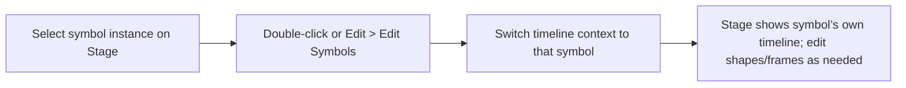
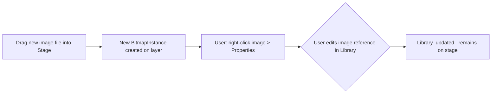
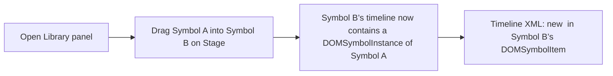

## Data Model and Schema

Based on the above, a simplified ER/UML model can be proposed. Major entities include: **Document**, **SymbolDefinition**, **Frame**, **Layer**, **Shape**, **FillStyle**, **StrokeStyle**, **BitmapItem**, **SymbolInstance**, etc. Key relationships:

- **Document** (root) contains one main **Timeline** and references a **Library** of symbols and bitmaps.
- **SymbolDefinition** (library) has a Timeline with Layers and Frames.
- **Layer** has name, type, and contains multiple **Frame**s.
- **Frame** has index, duration, tweenType, and a collection of **ElementInstance**s.
- **ElementInstance** can be a **Shape**, **SymbolInstance**, or **BitmapInstance**.
- **Shape** has one-to-many **FillStyle** and **StrokeStyle**, and one path definition (edges).
- **SymbolInstance** has a reference to a **SymbolDefinition**, transform matrix, filters, blend mode, instance name, etc.
- **BitmapInstance** refers to a **BitmapItem** with transform, etc.
- **BitmapItem** holds image metadata (source path, compression, etc.).
- Each **Shape** may optionally be linked to a **Mask** (through layer structure).

A rough UML class diagram (not drawn here) would have classes like `SymbolItem`, `Timeline`, `Layer`, `Frame`, `Shape`, `SymbolInstance`, `BitmapItem`, `BitmapInstance`, `FillStyle`, `StrokeStyle`, etc., with attributes matching the XML. For brevity, below is a **JSON/XML schema example** for key entities:

```xml
<!-- Example XML schema fragment for DOMSymbolItem -->
<xs:element name="DOMSymbolItem">
  <xs:complexType>
    <xs:sequence>
      <xs:element name="timeline" type="TimelineType"/>
    </xs:sequence>
    <xs:attribute name="name" type="xs:string" use="required"/>
    <xs:attribute name="itemID" type="xs:string" use="required"/>
    <xs:attribute name="linkageClassName" type="xs:string"/>
    <!-- ... other attributes ... -->
  </xs:complexType>
</xs:element>

<!-- TimelineType defines layers and frames -->
<xs:complexType name="TimelineType">
  <xs:sequence>
    <xs:element name="layers" type="LayerListType"/>
  </xs:sequence>
</xs:complexType>

<!-- LayerListType and LayerType -->
<xs:complexType name="LayerListType">
  <xs:sequence>
    <xs:element name="DOMLayer" type="LayerType" maxOccurs="unbounded"/>
  </xs:sequence>
</xs:complexType>
<xs:complexType name="LayerType">
  <xs:sequence>
    <xs:element name="frames" type="FrameListType"/>
  </xs:sequence>
  <xs:attribute name="name" type="xs:string" use="optional"/>
  <xs:attribute name="layerType" type="xs:string"/>
  <xs:attribute name="visible" type="xs:boolean"/>
  <xs:attribute name="locked" type="xs:boolean"/>
</xs:complexType>

<xs:complexType name="FrameListType">
  <xs:sequence>
    <xs:element name="DOMFrame" type="FrameType" maxOccurs="unbounded"/>
  </xs:sequence>
</xs:complexType>

<xs:complexType name="FrameType">
  <xs:sequence>
    <xs:element name="elements" type="ElementsType"/>
  </xs:sequence>
  <xs:attribute name="index" type="xs:int" use="required"/>
  <xs:attribute name="keyMode" type="xs:int"/>
  <xs:attribute name="tweenType" type="xs:string"/>
  <xs:attribute name="duration" type="xs:int"/>
</xs:complexType>

<xs:complexType name="ElementsType">
  <xs:sequence>
    <xs:choice maxOccurs="unbounded">
      <xs:element name="DOMShape" type="ShapeType"/>
      <xs:element name="DOMSymbolInstance" type="SymbolInstanceType"/>
      <xs:element name="DOMBitmapInstance" type="BitmapInstanceType"/>
      <!-- ... other element types -->
    </xs:choice>
  </xs:sequence>
</xs:complexType>

<xs:complexType name="ShapeType">
  <xs:sequence>
    <xs:element name="fills" type="FillListType"/>
    <xs:element name="strokes" type="StrokeListType"/>
    <xs:element name="edges" type="EdgeListType"/>
  </xs:sequence>
</xs:complexType>
```

And a JSON model might look like:

```json
{
  "SymbolItem": {
    "name": "MySymbol",
    "itemID": "uuid",
    "linkageClassName": "MySymbol",
    "timeline": {
      "layers": [
        {
          "name": "Layer 1",
          "frames": [
            {
              "index": 0,
              "elements": [
                {"type": "Shape", ...},
                {"type": "SymbolInstance", ...}
              ]
            }
          ]
        }
      ]
    }
  }
}
```

These schemas are illustrative. The actual XFL is more flexible (e.g. it allows arbitrary child order in many cases). The key idea is that each XML element has corresponding classes/fields in a data model.

## Parsing and Serialization

To parse XFL files, use a standard XML parser (with namespace support). For example, in Python:

```python
import xml.etree.ElementTree as ET
ns = {'x': 'http://ns.adobe.com/xfl/2008/'}
tree = ET.parse('DOMDocument.xml')
root = tree.getroot()

# Find all shape elements
for shape in root.findall('.//x:DOMShape', ns):
    # Process fills
    for fill in shape.findall('.//x:FillStyle', ns):
        if fill.find('.//x:SolidColor', ns) is not None:
            color = fill.find('.//x:SolidColor', ns).get('color')
    # Parse edges data string
    edges = shape.find('.//x:edges/x:Edge', ns).get('edges')
    # (Split and interpret '!' '/' '[' tokens into path commands)
```

Likewise, a `<DOMSymbolInstance>` can be parsed as:
```python
for inst in root.findall('.//x:DOMSymbolInstance', ns):
    symbol_name = inst.get('libraryItemName')
    # matrix
    mx = inst.find('.//x:matrix/x:Matrix', ns)
    a,b,c,d,tx,ty = mx.get('a'), mx.get('b'), mx.get('c'), mx.get('d'), mx.get('tx'), mx.get('ty')
    reg = inst.find('.//x:transformationPoint/x:Point', ns)
    if reg is not None:
        rx, ry = reg.get('x'), reg.get('y')
```

When serializing, ensure to preserve proper namespacing (typically `xmlns="http://ns.adobe.com/xfl/2008/"`) and to order sub-elements correctly (e.g. `<fills>`, `<strokes>`, `<edges>` in `<DOMShape>`). Be mindful that some values (like frame spans or durations) are integers, whereas coordinates are floats or fixed-point. For example, XFL uses twips, so one might need to convert: the community has observed coordinates often divide by 20 (since 1 unit = 1/20 pixel)【25†L1242-L1250】. Also, the “#” prefixed numbers are 32-bit fixed-point (as noted in XFL docs【18†L165-L168】). When writing out XML, use exactly the syntax Animate expects (e.g. no extra whitespace in `<Edge edges="..."/>` strings). 

**Version/Backward Note:** Because Adobe has not published an official schema【59†L180-L187】, parsers must be robust: ignore unknown XML nodes, and default missing ones. Always test with multiple Animate versions, and if re-writing an XFL, preserve all attributes not under modification (GUIDs, timestamps, etc.) to avoid breaking Animate’s internal consistency.

## Performance and Memory Implications

XFL files can be very verbose. Large vector shapes generate long `edges` strings, and high frame counts multiply XML size. This impacts both parsing speed and memory usage. To mitigate:

- **Streaming parse:** For huge files, use an event-driven parser (SAX/StAX) to handle one element at a time, rather than loading the entire tree.
- **Shape caching:** In many projects, identical shapes may be reused. Consider factoring repeated path data into symbols or using reference instances rather than duplicates in XML.
- **Optimizing bitmaps:** The `.dat` format for bitmaps is compressed (zlib)【48†L139-L142】. Large images will decompress to RAM at load, so limit bitmap resolution or link instead of embedding.
- **Skipping hidden layers:** The library or timeline may contain unused items. The Animate UI allows pruning unused assets【52†L107-L113】; similarly, a parser tool could skip objects not visible or referenced.
- **Twip precision:** Coordinates are stored as integers (twips) or fixed-point. Converting to floats is cheap, but using integer math can be faster if many points.
- **Batch updates:** When serializing, accumulate changes and write out in bulk. Frequent small writes to DOM can slow down.

In practice, Animate itself must handle large timelines and multiple layers. It uses a merge-drawing model internally【48†L126-L133】 (all shapes are flattened onto layers), so complex projects may slow the UI. Efficiently toggling visibility or simplifying hidden layers can help. Also note that `<frameRight>`/`<frameBottom>` metadata in bitmap items does *not* drive resizing – it’s only informational【48†L139-L142】, so it can be ignored in rendering logic.

## Security Considerations

XFL is an XML-based format that may reference external resources. To avoid security risks when loading an XFL:

- **Sanitize XML:** Use a secure XML parser (disable DTD/external entity loading) to prevent XXE attacks.
- **Validate sources:** Images (bitmaps) are often linked via `sourceExternalFilepath`; ensure these paths point to valid, expected locations. Do not auto-download remote URLs in an XFL.
- **Linkage scripts:** Beware if the XFL triggers ActionScript or JSFL (Adobe’s JS) processing. Only process actions intended by the application.
- **File permissions:** When writing external assets (bitmaps, sounds), ensure the files do not overwrite important system files.
- **Sandbox:** If using a third-party tool to import XFL, run it in a restricted environment, since the data may be from untrusted sources.
- **Document origin:** Note that Adobe Animate announces users should backup projects by 2027【37†L0-L4】. This suggests XFL (and FLA) will remain closed after that. When working with Animate files from unknown origins, treat them cautiously (as with any complex binary/XML data).

Overall, handle XFL content as you would any project file: validate inputs, encode outputs safely, and do not execute embedded code.

## User Interface Panels

The Animate authoring environment presents different panels linked to the data above:

- **Property Panel:** Shows attributes of the current selection (stage object or keyframe). It has tabs (Tools, Object, Frame, Doc)【64†L19-L22】. In the Object tab, a selected symbol or shape shows transform fields (X, Y, W, H, Rotation), color/fill settings, stroke settings, filters, blend mode, and Instance Name. For example, setting the Instance Name in UI writes the `instanceName` attribute in XML【66†L200-L203】. Color effects (tint, brightness, alpha) can be edited here and are saved per instance【66†L206-L214】【66†L235-L244】.  Buttons for alignment, flipping, etc. appear in the inspector as well.

- **Timeline Panel:** Displays layers and frames for the current scene or symbol. Each row is a layer (name column on left, with visibility/lock/mask icons), and frames run horizontally. Keyframes appear as circles; frame spans as colored bars. The playhead (red line) indicates the current frame. Users can insert/remove keyframes (F6/F7) and frames (F5) via toolbar or context-menu; this adds corresponding `<DOMFrame>` entries.  Onion-skinning controls live in the header: clicking the Onion Skin button opens options (range, all frames, anchor markers, etc.)【61†L1-L5】. Scrubbing is done by dragging the playhead or clicking frame headers【61†L49-L52】. The timeline also supports folders (layer folders) and mask layers (setting a layer’s “Mask” property targets the parent layer above). The UI includes zoom/scale of frame view, and the timeline hamburger menu lets you change layer height and tool visibility【61†L29-L37】.

  Below is a mermaid flowchart of a common timeline interaction (moving playhead to a frame):

  ```mermaid
  flowchart LR
    A[Click or Drag Playhead] --> B[Timeline UI moves playhead line]
    B --> C[Expose frame contents in Stage View]
    C --> D[Update Properties panel for objects at that frame]
  ```
  
- **Library Panel:** A list of all symbols, bitmaps, sounds, etc. (flat or organized in folders). Each item shows name, type icon, usage count, linkage info【52†L55-L60】. Selecting an item shows its thumbnail preview at top of the panel【52†L67-L72】. Dragging an item from the Library to the Stage creates an instance (adding a `<DOMSymbolInstance>` or `<DOMBitmapInstance>` to the current frame)【52†L79-L82】. The panel supports search (filter by name) and sorting. The “New Symbol” button lets users convert selected stage objects into a symbol (creating a new `<DOMSymbolItem>` and rewriting the current frame's elements accordingly). Right-click context menus allow creating folders, renaming, deleting, and updating/linking assets (e.g. replacing a linked image file).

- **Stage/Viewport:** The main canvas where symbols, shapes, and bitmaps are placed and transformed. Objects on the stage are backed by corresponding XML (`<DOMShape>`, `<DOMSymbolInstance>`, etc.). The stage supports dragging to re-position (which updates the `<Matrix>` `tx,ty`), corner-drag to scale (updates `a,d`), and rotate handles. Double-clicking a symbol instance enters that symbol’s timeline (editing mode) – UI reflects this by changing the breadcrumb and timeline context. Right-click on stage objects offers context menus (e.g. Convert to Symbol, Break Apart, etc.), invoking modifications to the XML. For example, choosing “Mask” on a layer context menu sets that layer’s type to Mask in the timeline XML.

- **Context Menus & Shortcuts:** The UI supports many actions via menu or keyboard. Notable ones include F6 (Insert Keyframe), F5 (Insert Frame), F7 (Insert Blank Keyframe) in the Timeline (which insert appropriate `<DOMFrame>` entries); Ctrl+F8 (Create Symbol dialog) to define a new symbol from selection; Ctrl+C/V for copy-paste objects (which duplicate `<DOMShape>` or `<DOMSymbolInstance>` nodes); Delete key to remove objects (delete XML elements). Right-clicking a `<DOMFrame>` in the UI can insert/remove frames or keyframes, adjusting XML (e.g. changing `duration` or splitting `<DOMFrame>` tags). Symbol instances can be given instance names via the Properties panel (entering text updates the XML). Library panel shortcuts (e.g. context “Update”) re-import linked assets. Most common tasks use intuitive drag-and-drop (drag symbol to stage), menu commands, or panels. For example, dragging a symbol within the Library into another Library (or onto Stage) will add a `<Include>` link if from external XFL, or copy the `<DOMSymbolItem>`.

**Table: XML vs UI Controls**

| Animate XML Element       | Key Attributes            | Corresponding UI       | UI Control/Panel                         |
|--------------------------|---------------------------|------------------------|-------------------------------------------|
| `<DOMTimeline>`          | name                      | Scene/Symbol timeline  | Timeline panel (header shows name)        |
| `<DOMLayer>`             | name, color, layerType, visible, locked | Layer row             | Timeline Layers (with color, eye/lock icons) |
| `<DOMFrame>`             | index, keyMode, tweenType, duration, label | Frame cell           | Timeline frame display (dot/span, label) |
| `<DOMShape>`             | (contains edges/fills)    | Shape object           | Stage canvas drawing                      |
| `<FillStyle color>`      | color, alpha              | Fill color             | Properties panel: Fill color picker       |
| `<StrokeStyle>`          | weight, caps, joints      | Stroke line            | Properties panel: Stroke weight/style     |
| `<Edge>`                 | edges (command string)    | Vector path            | (internal) drawn shape path on canvas     |
| `<DOMSymbolItem>`        | name, linkageClassName    | Library symbol         | Library panel item, Symbol Properties     |
| `<DOMSymbolInstance>`    | libraryItemName, symbolType, loop, instanceName | Instance on stage | Stage symbol, selectable instance        |
| `<matrix>` (`a,b,c,d,tx,ty`) | transform              | Position/Rotate/Scale  | Transform fields in Properties (X,Y,Scale,Rotate)【34†L121-L125】 |
| `<transformationPoint>`  | (Point x,y)              | Reg Point              | In Properties (via Registration dialog)【34†L129-L133】 |
| `<DOMBitmapItem>`        | name, href, compression  | Library bitmap         | Library panel item (image icon)          |
| `<DOMBitmapInstance>`    | libraryItemName          | Bitmap on stage        | Stage image object                        |
| `linkageClassName`       |                           | AS linkage             | Symbol’s Linkage properties               |
| `<DOMSoundItem>` (if any)|                           | Audio asset            | Library panel (audio icon)                |

Each UI control maps to one or more XML fields. For instance, the Library panel’s “Usage” column (how many times an item is used) reflects the count of `<DOMSymbolInstance>` references. The “Linkage” column corresponds to attributes like `linkageClassName` or `linkageExportForAS`. Many animate panels are also accessible via keyboard (e.g. Ctrl+F3 toggles Properties panel【64†L15-L18】).

## Interaction Flows

Below are mermaid diagrams illustrating common tasks in Animate:

```mermaid
flowchart LR
  A[Select objects on Stage] --> B[Create Symbol (Ctrl+F8)]
  B --> C{Set Symbol Name/Type}
  C --> D[Symbol added to Library, instance created on Stage]
```

- **Create Symbol:** The user selects one or more shapes/instances on stage, opens the **Convert to Symbol** dialog (Ctrl+F8), enters a name and type (Graphic/MovieClip/Button), and clicks OK. Internally, Animate creates a new `<DOMSymbolItem>` in the library XML, moves the selected objects into that symbol’s timeline (as `<DOMShape>` or `<DOMSymbolInstance>`), and replaces them on the main stage with a new `<DOMSymbolInstance>`. 



- **Edit Symbol:** Double-clicking a symbol instance or choosing **Edit>Symbol** dives into that symbol’s timeline. The Timeline panel now shows the symbol’s layers/frames (as defined in its XML), and the Stage is isolated to that symbol. The user can then move shapes or edit frames. Changes (new shapes or moved objects) update the `<DOMShape>` and `<DOMFrame>` entries inside that symbol’s `<DOMSymbolItem>` file. When done, the user clicks “Scene 1” (or applies **Edit>Document > Scene 1**), returning to the main timeline.



- **Replace Image:** The user can update a bitmap by editing its library entry. For example, they may replace the external file path in `<DOMBitmapItem sourceExternalFilepath="..."/>` and then use *Modify→Bitmap→Modify* to reload it. This updates the `<DOMBitmapItem>` XML (source, href, etc.) while existing `<DOMBitmapInstance>` entries keep the same `libraryItemName`, so they show the new image.



- **Nest Symbols:** Simply dragging one symbol from the Library (or Stage) onto another symbol’s stage area creates a nested symbol instance. This adds a `<DOMSymbolInstance>` in the target symbol’s layer/frame XML. The UI shows the nested symbol and lets the user position/transform it as usual (updating the nested instance’s `<matrix>`).

```mermaid
flowchart LR
  A[Draw shape on Layer 2] --> B[Set Layer 1 as Mask via context menu]
  B --> C[XML: Layer 2 gets attribute maskLayer="Layer 1"]
  C --> D[Playback: Layer 2’s contents used as mask for Layer 1]
```

- **Apply Mask:** When the user sets a layer as a mask (by right-clicking a layer and choosing Mask), Animate changes the XML so that the mask layer is linked to its parent. Internally, `DOMLayer layerType="Mask"` and the layer above gets a reference like `maskLayerIndex`. The UI indicates masking by shading and outline.

```mermaid
flowchart LR
  A[Select symbol on Stage] --> B[Insert Motion Tween (right-click frame)]
  B --> C[Adjust instance’s position/rotation in Properties or Motion Editor]
  C --> D[Timeline: <DOMFrame tweenType="motion"> entries are updated]
```

- **Animate Tween:** Converting a frame span into a tween (e.g. right-click frame span “Create Motion Tween”) sets `tweenType="motion"` on that span’s `<DOMFrame>` and adds the final keyframe data. The UI displays tween spans with arrow overlays; dragging the symbol in a tween span updates that final keyframe’s `<matrix>`. 

Each of these flows corresponds to changes in the XML data: creating symbols adds `<DOMSymbolItem>` and `<DOMSymbolInstance>` entries, editing timelines modifies `<DOMFrame>` and `<DOMShape>`, etc. The UI and XML stay in sync: as the user manipulates objects, the corresponding XML is added/modified.  

## UI Control Panel Summary

Below is a summary table linking key UI controls to their XML data:

| UI Control          | Affected XML                               | Behavior                                                    |
|---------------------|--------------------------------------------|-------------------------------------------------------------|
| **Properties Panel (Object tab)** | `<DOMSymbolInstance>` or `<DOMBitmapInstance>` attributes (`matrix`, `instanceName`, blend, filters) | Shows/edits X,Y,Scale,Rotate (matrix), color effect sliders, instance name【66†L200-L203】 |
| **Properties Panel (Frame tab)**  | `<DOMFrame label="..."/>` children             | Edit frame label text, frame properties (duration, ease)    |
| **Timeline panel (layer row)**    | `<DOMLayer name="..."/>` attributes (visible, locked, layerType) | Toggle visibility/lock, set guide or mask (XML layerType change)【48†L152-L159】 |
| **Timeline panel (frame cell)**   | `<DOMFrame>` elements (keyMode, duration, tweenType) | Insert/clear keyframes (add/delete `<DOMFrame>`), set classic tween (tweenType)【70†L387-L395】 |
| **Library panel**                 | `<DOMSymbolItem>`, `<DOMBitmapItem>` entries      | Rename symbols/bitmaps (name attribute), set linkage (linkageClassName), drag-drop from Library creates instances (`<DOMSymbolInstance>`) |
| **Context menus**                | Various (e.g. Convert to Symbol, Break Apart)    | e.g. “Convert to Symbol” wraps selected shapes into new `<DOMSymbolItem>`; “Break Apart” explodes a symbol or text (deleting instance and replacing with shape instances) |
| **Drag-and-drop**                | N/A (implicitly modifies XML)                     | E.g. dragging bitmap file into Stage creates a new `<DOMBitmapInstance>` and library item; dragging Library symbols to Stage makes `<DOMSymbolInstance>` |

## Accessibility Considerations

Animate provides several accessibility features: most panels support keyboard navigation and shortcuts (see Adobe’s Keyboard Shortcuts list【39†L25-L33】【49†L11-L18】). Users can navigate the timeline via keys (e.g. SHIFT+, and SHIFT+. to go to start/end【49†L11-L18】, arrow keys to move frame-by-frame). The interface has an Accessibility section in the docs【64†L19-L22】; in recent versions the Properties panel is designed with larger touch targets and a cleaner layout for visibility. 

For designing a similar interface, ensure:
- All controls have keyboard focus support (tab order in panels).
- Panels use high-contrast color outlines for selection (Animate shows orange outlines for selected objects by default).
- Provide ARIA labels for icons (e.g. layer visibility, mask icons).
- Keyboard shortcuts for all operations (in addition to menu items).
- Panel sections should be collapsible for screen-reader friendly navigation (the user can rearrange Property Inspector sections【64†L47-L50】).
- **Onion-skin controls** and frame navigation should be operable by keyboard (e.g. spacebar to play, arrow keys to step frames, as Animate supports).
- Provide textual alternatives: frame labels visible in text, panel headings, etc., since timeline is largely visual.
  
These ensure users with disabilities can operate the timeline and property panels effectively.

## Conclusion

In summary, Adobe Animate’s XFL format is a rich XML schema that mirrors the authoring UI’s constructs. Symbols, shapes, and timelines in the UI correspond one-to-one with XML elements like `<DOMSymbolItem>`, `<DOMShape>`, `<DOMFrame>`, etc., as illustrated above【32†L106-L115】【32†L118-L124】【70†L387-L395】. The Properties and Timeline panels allow interactive editing of the same data (instance transforms, keyframes, color effects) that are ultimately serialized into XML. Understanding XFL’s structure enables building tools that import, export, or manipulate Animate projects programmatically. This document has outlined the detailed mapping between Animate’s UI panels and its XML data, provided schema examples, and highlighted practical concerns (parsing, performance, security) for working with XFL files, all backed by Adobe’s documentation and expert sources【71†L182-L184】【59†L180-L187】【18†L151-L159】. The enclosed flowcharts and tables serve as a blueprint for both developers and UI designers to understand and replicate Animate’s functionality in new applications or pipelines.

