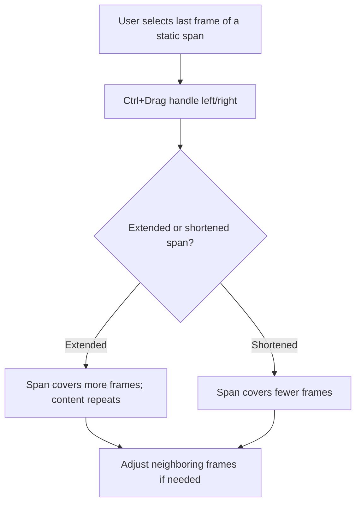
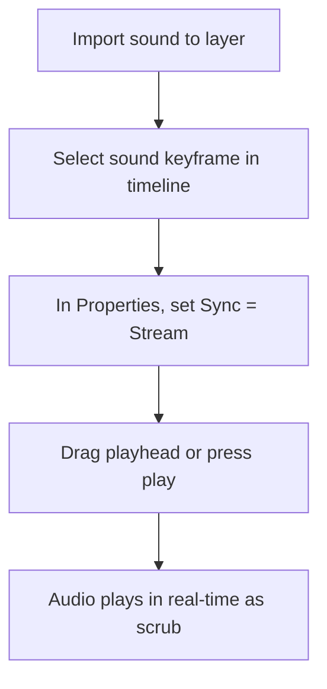

# Executive Summary  
Adobe Animate’s Timeline (formerly the Timeframe panel) is the central interface for controlling time-based content. It **organizes animation in layers and frames**, similar to stacked film strips【53†L175-L183】. Layers appear in a vertical column, and frames of each layer extend horizontally. The playhead indicates the current frame on stage and by default loops at the end【53†L189-L191】. The Timeline provides tools for creating **keyframes, frames, and tweens**; managing layer properties (lock, hide, outline); and syncing audio and symbols. For each feature—whether layers, keyframes, tweens, or camera controls—the UI presents intuitive icons (e.g. eye icon for visibility, padlock for lock) and menu commands. Users interact via direct manipulation (click-drag frames, click icons), context menus (right-click on layers or frames), and keyboard shortcuts (F5–F7 for frames/keyframes, among others【79†L234-L242】).  

Animate’s Timeline supports two main animation modes: **frame-by-frame** (explicit keyframes/blank frames) and **tweening** (Classic or Motion tweens). In frame-by-frame mode, each frame holds unique content; users insert blank keyframes or frames and draw on each one. In tweening mode, users define start/end keyframes and let Animate interpolate between them. The Timeline lets users switch modes seamlessly (e.g. by inserting or clearing keyframes)【81†L330-L339】. Motion Tweens and Classic Tweens have slightly different workflows (tables below compare them). Extensive timeline controls (toolbar buttons or hamburger menu) enable adding frames/keyframes, turning onion skin on/off, expanding or zooming the timeline, and more【42†L579-L588】【58†L297-L304】. Accessibility is supported via clear labeling of frames, keyboard navigation (e.g. F-keys, Ctrl/Alt modifiers), and visual cues (color-coded keyframes and onion-skin ranges). This document details each major Timeline feature: its purpose, UI affordances, precise interaction steps, system response, edge cases, and accessibility considerations. Common user tasks (e.g. “create animation”, “convert frame to tween”, “retime animation”, “sync audio”) are mapped to step-by-step flows (with diagrams). Tables compare overlapping features and list timeline-specific shortcuts. 

## Timeline UI Components  
The Timeline panel consists of:  
- **Layer Panel (left column):** Lists layer names with icons for options. Each layer row includes (from left) an icon indicating layer type (normal/mask/guide/camera), an “eye” icon (visibility), a padlock icon (lock/unlock), and an “outline” icon (outline mode)【35†L434-L443】. Folders (layer groups) also appear here. The current layer is highlighted and marked by a pencil icon【33†L174-L183】. Right-click on a layer name opens a context menu (Insert Layer/Folder, Delete, Rename (Properties), Copy/Cut/Paste Layers)【77†L1-L10】【37†L359-L368】.  
- **Frame Area (right of layers):** Displays frames as a grid of cells. Frame numbers run along the top header. Keyframes appear as solid dots, empty keyframes as hollow circles, and tween spans as colored bars with arrows【53†L237-L243】. Below the frame numbers is the playhead (a red vertical line and triangle), which can be dragged or moved via keyboard/Playback controls. The bottom status bar shows frame number, FPS, and elapsed time【53†L189-L193】.  
- **Timeline Toolbar (top/right of panel):** Contains buttons for adding frames/keyframes (grouped under one icon), creating tweens (another icon), playback (play, loop toggle), and view controls. A “hamburger” menu (upper-right) gives options like span-based selection, Layer Height (Short/Medium/Tall)【41†L1-L4】, and “Customize Timeline Tools”【42†L579-L588】. Users can show/hide these controls via the menu (e.g. toggling “Insert Keyframe” vs “Keyframe” buttons).  
- **Additional Panels/Indicators:** The Timeline may include sub-panels or overlays, such as the Onion Skin controls (range indicators and on/off toggle) or the Camera layer’s viewport frame. When a Camera is enabled, a colored boundary and Camera icon appear on stage and in the timeline, and a special camera properties section appears【67†L212-L221】【67†L229-L237】. 

**Annotations (mockup):** The Layers column (A) shows layer toggles (B=eye for visibility, C=lock, D=outline). Frame cells (E) show keyframe dots or spans. The playhead (F) can be clicked/dragged. Toolbar icons (G) include Insert Frame, Insert Keyframe, Classic Tween, etc. *[*No official UI image available for embedding; see Adobe Help Center for similar diagrams.*]*  

## Layers and Layer Controls  
**Purpose:** Layers organize artwork into separate strips. Users can stack content, hide/show elements, lock editing, outline, and group layers. Special layers (mask, guide, camera) have unique behaviors【33†L197-L207】【33†L210-L218】. Layer folders group layers. Advanced Mode (on by default) treats each layer as a symbol for depth/parenting/camera【35†L548-L557】.  

**UI Affordances:** Each layer row has icons: eye (visibility), padlock (edit lock), outline square (outline view). These toggle states on/off when clicked【35†L421-L430】【37†L361-L370】. To create a layer, use the “New Layer” button or Insert menu【33†L229-L238】. Folders are similar (Insert > Layer Folder or button【33†L242-L251】). Layers are renamed via double-click name or Properties dialog. Drag-and-drop reorders layers or moves into folders【33†L266-L274】.  

**Interaction Paths:**  
- *Create Layer:* Click “+” New Layer button at bottom of Timeline or Insert > Timeline > Layer【33†L229-L238】. The new layer appears above the selected layer and becomes active.  
- *Create Folder:* Click “New Folder” icon or Insert > Timeline > Layer Folder【33†L244-L251】. Folder appears above selection. Drag layers into it.  
- *Reorder/Group:* Click-drag a layer name up/down. Drag onto a folder to nest【33†L269-L277】.  
- *Rename:* Double-click layer name or right-click > Properties > edit name【77†L10-L19】.  
- *Hide/Show:* Click an “eye” cell in that layer’s row. Alt/Option+Click hides all others (solo)【35†L430-L433】. Drag through eye column to bulk-toggle visibility.  
- *Lock/Unlock:* Click padlock in layer row. Alt/Option+Click locks all others (solo lock)【37†L369-L372】. Drag through lock column to lock multiple.  
- *Outline Mode:* Click outline box to show that layer as colored outline【35†L434-L443】. Alt+Click outlines all other layers. Drag through outline column to outline multiple.  
- *Layer Transparency:* Shift+Click eye icon sets layer to semi-transparent view【35†L527-L534】 (no affect on hidden layers). Or use right-click > Properties > Visibility > Transparent【35†L534-L542】.  

**System Response:** Toggling eye shows/hides layer content on Stage. A red “×” overlays the eye icon when hidden【35†L421-L430】. Lock icon shows padlock when engaged. Outline icon shows layer objects as outlines of its assigned color. Renaming updates label immediately. Creating/deleting layers updates the stack.  

**Edge Cases:** Locking a folder locks all its children【33†L266-L274】. Deleting a folder deletes all sub-layers【37†L350-L359】. Copying/pasting layers preserves folder hierarchy【37†L381-L390】 (CS5.5+ only). Hidden layers may or may not publish depending on settings.  

**Accessibility:** Layer names and icons have tooltips. Keyboard: no direct keys for new layer, but Menu shortcuts apply (Insert > Layer). Tab navigation through Timeline is limited; reliance is on mouse and menu. The color outline helps visually distinguish layers.  

## Frames and Keyframes  
**Purpose:** Frames divide time. **Keyframes** mark points where content changes. Frames between keyframes inherit content (static span) or interpolate (tween span)【53†L210-L218】. Users insert blank frames, keyframes, or extend sequences to sculpt timing.  

**UI Affordances:** The frame grid shows numbered columns. Keyframes appear as **black dots** (content) or hollow circles (blank)【53†L232-L240】. Tween spans are highlighted (classic tweens blue with arrow, motion tweens green/blue band). The Property Inspector shows frame labels when a keyframe is selected. A **hamburger menu** in timeline header toggles “Span-Based Selection” and layer height【58†L306-L314】.  

**Interaction Paths:**  
- *Insert Frame:* Select a frame cell; press **F5** or Insert > Timeline > Frame【79†L234-L242】. This extends the previous frame content.  
- *Insert Keyframe:* Select a frame; press **F6** or right-click > Insert Keyframe【79†L234-L242】. This duplicates content from previous frame into a keyframe (solid dot).  
- *Insert Blank Keyframe:* Select a frame; press **F7** (Shift+F6 may also) or right-click > Insert Blank Keyframe【79†L234-L242】. This makes keyframe empty (hollow circle).  
- *Move Frames:* Drag a frame or selection of frames (clicked or shift-clicked) left/right. The span moves and existing frames shift accordingly【39†L359-L368】. Alt/Option-drag copies frames instead.  
- *Copy/Paste Frames:* Select frame range; Edit > Timeline > Copy Frames, then select a destination frame > Paste Frames. Alternatively, Alt-drag to copy a keyframe【39†L336-L342】. Paste Frames will replace or insert frames.  
- *Remove Frame(s):* Select frame(s); Edit > Timeline > Remove Frame or right-click > Remove Frames【39†L347-L355】. This deletes frames leaving others unaffected. Remove Frame on a keyframe shifts preceding content forward.  
- *Clear Keyframe:* Select a keyframe; Edit > Timeline > Clear Keyframe or right-click > Clear Keyframe【39†L353-L357】. This deletes the keyframe (its contents vanish) and subsequent span fills from previous frame’s content.  
- *Change Frame Span Length:* On a static (non-tween) span, Ctrl-drag (Win) or Cmd-drag (Mac) the start/end frame of the span to stretch/shrink the duration【39†L364-L370】. For frame-by-frame animations (many contiguous keyframes), use specific commands (see Frame-by-Frame animations guide).  
- *Frame Labels:* Select a keyframe and type a name into the *Label* field of the Property Inspector【58†L297-L304】. Press Enter to set. Labels (e.g. “start”, “loop”) serve as navigation targets. Best practice: put all labels on their own “labels” layer for clarity【58†L293-L302】.  

**System Response:** Inserting frames adds column cells. Keyframes get a dot icon. Moving/copying changes the span shown (gray vs white for empty spans)【53†L232-L240】. Pasting frames overwrites or inserts content in the timeline grid. Clearing keyframes turns black dot to hollow or removes it. Labels appear in the frame header. Span-based selection (hamburger menu) makes a click select the whole span from one keyframe to the next【58†L306-L315】.  

**Edge Cases:** If you insert frames on a tween span, the span expands (no interpolation changed unless keyframes move). Removing a keyframe in the middle of a tween breaks it; Animate will treat the following frames as a static span or as part of a broken tween. Copy/Paste frames across layers may fail if layers are of different types (e.g. pasting into a mask/guided layer)【37†L395-L398】.  
One must set the timeline to *Span-Based Selection* (hamburger > “Span Based Selection”) to easily move whole sequences【58†L306-L315】. Otherwise, clicking only selects one frame cell.  

**Accessibility:** Keyframe dots are high-contrast black. The frame header shows numbers and any applied labels. Keyboard shortcuts (F5–F7) speed insertion. The context menu provides alternate (Ctrl+click) access. Zooming timeline (see below) helps users with low vision see frames.  

## Tweens (Classic and Motion)  
**Purpose:** Tweens automate in-between frames between keyframes. **Classic Tween** (legacy) can tween motion or color; **Motion Tween** (newer) uses single keyframe properties and Motion Editor for easing【81†L343-L352】. Users use tweens to animate position, size, rotation, color, filters, etc.  

**UI Affordances:** Tween spans appear as colored bars filling the timeline cells: Light-blue with arrow for Classic, green/blue for Motion【53†L237-L243】. Each tween span has a pair of filled keyframe icons (start and end) and an arrow indicating interpolation. Tween buttons (in toolbar) allow quick tween insertion, and Property Inspector shows tween properties (easing, rotation) when a tween span is selected【81†L332-L339】.  

**Interaction Paths:**  
- *Classic Tween:* Requires two keyframes (content on both). Select any frame between them and choose Insert > Classic Tween, or right-click and “Create Classic Tween”【81†L332-L339】. Animate then fills the span with tween. Adjust properties: select the tween span and use the Property Inspector’s Tweening panel (choose Rotate, set Ease)【81†L343-L352】. Right-click on span for “Clear Classic Tween” if needed.  
- *Motion Tween:* Simpler for symbol instances or text. Place an instance on stage, right-click the first frame and select “Create Motion Tween” (or from toolbar)【79†L200-L209】. Animate automatically adds keyframes when you move/transform the object in the timeline, marking property changes with diamond icons. The Property Inspector shows tween properties (e.g. easing, snapping) for Motion tweens as well.  
- *Refine with Motion Editor:* After creating a tween (classic or motion), double-click the tween span or right-click and choose “Refine Tween” to open the Motion Editor panel【48†L214-L222】. There, property curves appear and you can add custom eases or anchor points for precise timing. Use the Ease fields or click “Edit” next to Ease for dialog box【81†L347-L355】.  
- *Reverse or Sync:* Select a tween’s frames and use Modify > Timeline > Reverse Frames. For graphic symbols, use the “Sync” or “Looping” options in the Property Inspector to match symbol frames【81†L385-L394】.  

**System Response:** Upon creating a tween, the span between keyframes turns blue (classic) or green (motion). Interpolated frames are shown as gray thumbnails or preview. Playing the timeline animates the tween smoothly. Changing keyframe properties automatically updates the tween. The Motion Editor displays curves for each animated property【48†L168-L176】.  

**Edge Cases:** Classic tweens do not support some newer features (no 3D tweening, limited easing). Motion tweens are limited to single object layers. Converting a keyframe to frame (Clear Keyframe) will break the tween. Motion tween vs classic tween: only one type can occupy a span at once. If a layer already has a motion tween, converting to classic tween requires clearing first (or vice versa). If you add or remove frames after tween creation, Animate recalculates the tween.  

**Accessibility:** Tween icons (arrows, diamonds) are color-coded. The Motion Editor panel is tab-order navigable and offers descriptive labels for curves. Keyboard: no default next-keyframe shortcut, but toolbar buttons (Step Forward, Step Back) are accessible via customizable shortcuts.  

## Onion Skinning  
**Purpose:** Onion skinning displays multiple frames’ content simultaneously (past and future) to help animators see motion flow.  

**UI Affordances:** The Onion Skin button (camera-looking icon) is on the Timeline toolbar. When on, timeline header shows two colored markers: green (previous) and blue (next) frame anchors【28†L7-L15】. Frames in range appear tinted on stage (different opacity) showing ghost images.  

**Interaction Paths:**  
- *Toggle Onion Skin:* Click the Onion Skin button (looks like stacked circles) in the timeline toolbar. Alternatively, menu Window > Onion Skin.  
- *Set Range:* Alt-click a frame in the range (as marker) to anchor. Use “Onion Skin” menu for modes: selected range, all frames, skip frames, keyframe only【28†L7-L15】. Drag the green/blue bars in the timeline header to expand or contract range.  
- *Settings:* Long-click Onion Skin button or click a caret to access “Onion Skin Settings”. Enable “Keyframes only” to skip tween frames【28†L13-L21】.  

**System Response:** Frames within the onion range are overlaid on stage (color-coded by distance). The timeline shows anchors at range limits. The color coding (if enabled) distinguishes older frames vs newer ones. 

**Edge Cases:** Onion skin is off in Publish (only for authoring). Overlapping shapes may clutter view—use keyframe-only option to simplify. Undo/redo works with onion skin state. If timeline spans are very long, onion skin can slow performance.  

**Accessibility:** Onion skin colors help differentiate frames; keyboard focus not directly applicable. No known screen reader support beyond stating on/off.  

## Frame Rate and Timing  
**Purpose:** Frame rate (FPS) sets playback speed. Adjusting FPS changes animation speed or (with scaling) frame durations.  

**UI Affordances:** FPS is shown in the Timeline status bar【53†L189-L194】. To change it, use Modify > Document Settings (or enter in Properties). A “Scale Frame Spans” checkbox option adjusts frame spans to keep timing constant【53†L127-L132】.  

**Interaction Paths:**  
- *View FPS:* Bottom of timeline shows “30.0 fps” (default 24.0).  
- *Change FPS:* Choose Modify > Document (or Properties) > Change Frame Rate. Enter new FPS. Check **Scale Frame Spans** to proportionally adjust lengths (e.g. 24→48 fps halves frame count)【53†L127-L132】.  
- *Frame-by-Frame Adjustment:* Dragging a keyframe horizontally changes span length; Animate maintains fps constant.  

**System Response:** Changing FPS without scaling will make animation play faster/slower. With scaling, frame counts change (timeline lengthens or shortens) but total time is same. The FPS readout updates.  

**Edge Cases:** If scale is unchecked, audio/video sync can break. Extremely high FPS may not display smoothly.  

**Accessibility:** FPS numeric field is keyboard-navigable. No direct impact on screen readers beyond descriptions.  

## Frame Picker and Symbols  
**Purpose:** The Frame Picker panel lets users choose which frame of a graphic symbol to display on the main timeline, aiding tasks like lip-sync. Only works for **Graphic** symbols.  

**UI Affordances:** Frame Picker is a separate panel (Window > Frame Picker). It shows thumbnails of each frame of a selected graphic symbol and a marker for the “First Frame”. 

**Interaction Paths:**  
1. Select a graphic symbol instance or library symbol.  
2. In Property Inspector under Looping, click **Use Frame Picker** (or Window > Frame Picker)【65†L382-L390】.  
3. The panel loads all frames of the symbol. Click any frame thumbnail to set it as the symbol’s first frame【65†L399-L407】.  

**System Response:** Selecting a frame in the picker immediately updates all instances of that graphic symbol on stage to display that frame on the timeline.  

**Edge Cases:** Frame Picker is disabled for Movie Clip or Button symbols【65†L389-L392】. If symbol has fewer frames than expected, the panel shows only available frames.  

**Accessibility:** The panel can be navigated via keyboard (arrow keys between frames). Tooltips indicate frame numbers.  

## Camera Layer  
**Purpose:** Animate’s Camera simulates a viewport through which all layers are seen, enabling panning, zooming, and rotation of the scene.  

**UI Affordances:** A Camera layer is a special layer with a camera icon. When enabled, a blue boundary appears on Stage (camera view)【67†L212-L221】. The Timeline adds a “Camera 1” layer at top. The Tools panel has a Camera tool icon.  

**Interaction Paths:**  
- *Enable Camera:* Click the Camera tool (looks like a camera) in Tools, or click the Add/Remove Camera button in the timeline (globe icon).  
- *Set Camera Keyframes:* With Camera layer active, move the playhead and use Free Transform or camera controls to pan/zoom; each action places a keyframe on the camera layer. Right-click on Camera layer to insert keyframes as needed.  
- *Camera Movement:* Drag stage with Camera tool to pan. Use zoom slider or numeric fields (Property inspector) to zoom【67†L238-L247】. Rotate via handles or numeric.  
- *Disable Camera:* Click camera icon off; camera layer becomes inactive.  

**System Response:** Enabling camera adds Camera layer and highlights it. Moving the camera updates the view for the current frame. Animating the camera moves/zooms all visible layers accordingly.  

**Edge Cases:** Only one Camera layer is allowed. Camera moves do not affect actual artwork layers. Hiding the camera layer stops view changes (camera off).  

**Accessibility:** The Camera tool has a tooltip; numeric fields can be typed.  

## Audio Scrubbing and Tracks  
**Purpose:** Animate supports sounds in the timeline. “Scrubbing” plays audio when dragging the playhead, assisting lip-sync and timing.  

**UI Affordances:** Sounds are placed by selecting a frame and using the Property Inspector’s Sound options. There is no dedicated “solo/mute per track” UI in Animate like in video editors; audio is controlled per layer or overall. Preferences (Edit > Preferences > Sound) include “Enable Timeline Audio Scrubbing”.  

**Interaction Paths:**  
- *Insert Audio:* Select a frame in a layer (or a new layer) and import sound via File > Import > Import to Stage. In Properties, assign Sound and Sync mode.  
- *Set Sync:* In Properties (Sound section), set Sync to **Stream** to allow scrubbing playback【69†L67-L70】.  
- *Scrub Audio:* Drag the playhead with mouse while holding Scrub audio button (speaker icon) active (see preferences). Or simply play the timeline. Comma/Period keys step frames; with **Stream** sync, audio for those frames plays.【69†L67-L70】.  
- *Mute/Unmute:* The Control menu has a **Mute Audio** toggle (mutes all sounds during editing).  

**System Response:** With Stream sync, dragging the playhead plays the audio in real-time. Using **Play** button plays audio. In **Event** sync, audio plays once when reaching its frame and cannot be scrubbed.  

**Edge Cases:** Only “Stream” mode allows real-time scrubbing【69†L67-L70】. Large audio files may stutter on scrub. Sound layers cannot be soloed; either the entire application audio is muted or not.  

**Accessibility:** Audio preferences and mute toggles have keyboard access.  

## Markers (Timeline Markers)  
**Purpose:** Animate supports **Frame Labels** (as above) but does not have rich marker features like other editors. Users simulate markers via labels or guide layers.  

**UI Affordances:** No dedicated marker UI. Users use frame labels or comments layers.  

**Interaction Paths:** Users can comment on frames via right-click > “Frame Comment” (rarely used). Or simply use frame labels as markers.  

**System Response:** Not applicable.  

**Edge Cases:** Not a native feature, skip detailed discussion.  

## Key Interaction Flows (Examples)  

### Create a Frame-by-Frame Animation  
```mermaid
flowchart LR
    A[User draws initial content] --> B[Timeline: Insert Blank Keyframe (F7)]
    B --> C[User draws next frame on Stage]
    C --> D[Timeline: Insert Keyframe (F6)]
    D --> E{More frames?}
    E -->|Yes| C
    E -->|No| F[End: Playback to preview animation]
```
1. The user selects a layer and draws content on Frame 1.  
2. Press **F7** (Insert Blank Keyframe) to create a blank keyframe at the next frame. The timeline shows a hollow circle.  
3. Draw new content on Stage for Frame 2. Press **F6** to make it a keyframe (solid dot).  
4. Repeat drawing and adding keyframes for each frame.  
5. When done, use playback (Play button or Enter) to animate through frames. The playhead loops by default【53†L189-L194】.

Expected: Each frame updates on stage. The Timeline shows a series of adjacent keyframes. If playback stutters, adjust FPS or insert more frames.  

### Convert Existing Frames to a Tween  
```mermaid
flowchart LR
    A[Select two keyframes with content] --> B[Click between them on timeline]
    B --> C[Right-click > Create Classic Tween]
    C --> D{Apply easing?}
    D -->|Yes| E[Select tween span, adjust Easing value or open Ease dialog]
    D -->|No| F[Tween created]
    E --> F
    F --> G[Adjust content if needed (start/end); Animate fills in-between]
```
1. The user has keyframes at Frame 1 and Frame 10 on the same layer, with an object.  
2. Select a frame in between (e.g. Frame 5); right-click and choose **Create Classic Tween**【81†L332-L340】.  
3. Animate turns Frames 1–10 into a tween span (light-blue with arrow). Content moves from start to end positions.  
4. Optionally, click the tween span and in the Property Inspector set an **Ease** (e.g. -50 for acceleration) or click *Edit* for custom curve【81†L347-L355】.  
5. Play to preview smooth motion.  

Expected: The object animates across the span. The timeline shows an arrow over the frames. Changing the end keyframe content (move object) auto-updates the tween.  

### Edit Keyframe Easing via Motion Editor  
```mermaid
flowchart LR
    A[Motion or Classic Tween exists] --> B[Double-click tween span]
    B --> C[Motion Editor panel opens with property graphs]
    C --> D[Select property curve (e.g. Position)]
    D --> E[Add Anchor/Ease points by clicking on graph]
    E --> F[Drag control handles to shape velocity curve]
    F --> G[Close Motion Editor; timeline easing updated]
```
1. With a motion tween span on stage, **double-click** it (or right-click > *Refine Tween*)【49†L1-L4】.  
2. The Motion Editor panel appears, showing curves for X, Y, rotation, etc【48†L222-L231】.  
3. Click on a curve to select that property (turns red).  
4. Add an Anchor Point at a desired time/frame, then adjust its incoming/outgoing handles to change ease.  
5. After editing, close or switch back to timeline. The tween now uses the custom ease.  

Expected: The animation playback now follows the new speed curve. Easing appears updated in the Property Inspector.  

### Retime (Rescale Frames)  

1. To **extend** a static frame span (pause), the user Ctrl-drag (Win) / Cmd-drag (Mac) the last frame to the right【39†L364-L370】.  
2. This creates additional empty frames with the same content (gray cells) until the dragged point.  
3. For **shrink**, drag left to remove frames.  
4. To **stretch a tween**, drag its end keyframe later in time—Animate will lengthen the tween.  

Expected: The duration of the content changes. Extending should keep on-stage content unchanged through the new frames.  

### Sync Audio with Animation  

1. Import audio into the timeline (e.g. insert sound on Layer 1, Frame 1).  
2. Select the frame, open Properties, set **Sync** to *Stream*. This ensures audio follows playhead【69†L67-L70】.  
3. Now dragging the playhead on timeline will play back the sound segment under the pointer. The Comma/Period keys can step frames and hear those audio samples.  

Expected: User hears the correct audio snippet while scrubbing. If Sync is *Event*, scrubbing produces silence (only plays on explicit Play).  

### Reuse Symbols Across Scenes (Nest Timelines)  
```mermaid
flowchart LR
    A[Create symbol (e.g. Button or MovieClip)] --> B[Place symbol on Scene1 timeline]
    B --> C[Switch to Scene2] 
    C --> D[Open Library panel] 
    D --> E[Drag existing symbol into Scene2 stage or timeline]
    E --> F[Instance of same symbol appears in Scene2]
    F --> G[Edit symbol once (library) to update both scenes]
```
- Animate supports **multiple scenes** each with its own timeline. Symbols created in one scene’s library are available in others. To reuse, simply drag the symbol from the Library into a scene’s stage or timeline. Editing the symbol (double-click to enter its timeline) updates all instances across scenes. This nests timelines: each MovieClip symbol has its own internal timeline, nested within the main scene timeline.  

Expected: Symbol animations (or graphics) appear identically in both scenes. Changing one propagates globally.  

## Feature Comparison Tables  

| Feature               | Classic Tween                            | Motion Tween                            |
|-----------------------|------------------------------------------|-----------------------------------------|
| Creation             | Insert two keyframes with content → right-click *Create Classic Tween*【81†L332-L339】. | Place one symbol instance, right-click first frame → *Create Motion Tween*. |
| Tween Indicators     | Blue span with arrow; solid start/end keyframes【53†L237-L243】. | Green/blue span; diamond icon property keyframes. |
| Editing Frames       | Only keyframes editable; must insert new keyframe to change. | Can directly edit object in any keyframe; new property keyframes added automatically. |
| Easing Control       | Set Ease value in Properties; limited to simple accel/decel【81†L347-L355】. | Use Motion Editor for per-property curves; supports multiple eases. |
| Property Scope       | Tween transforms and color, but no 3D.   | Can tween any animatable property, including filters and 3D (depending on document). |
| Performance         | Slightly lighter; stored as shape data. | Recommended for most; more flexible.  |
| Deprecated Note      | “Older way” – requires manual symbol conversion【81†L339-L344】. | Default method in modern Animate. |

| Timeline Feature             | Shortcut (Windows / Mac)         | Notes                                           |
|------------------------------|----------------------------------|-------------------------------------------------|
| Insert Frame                 | **F5**                           | Adds frame in selected layer【79†L234-L242】.   |
| Insert Keyframe              | **F6**                           | Duplicates previous frame as keyframe【79†L234-L242】. |
| Insert Blank Keyframe        | **F7**                           | Clears previous content at keyframe【79†L234-L242】. |
| Copy Frame(s)                | *Ctrl+C* / *⌘+C*                 | After selecting frame(s) in Timeline.           |
| Paste Frames                 | *Ctrl+V* / *⌘+V*                 | Inserts copied frames at playhead.             |
| Remove Frame(s)              | *Delete*                         | Deletes selected frame(s) (no content shift).   |
| Clear Keyframe               | *(no default key)*; context menu | Right-click on keyframe【39†L353-L357】.      |
| Next Frame                   | *.| (Period key)* (if focus on timeline) | Steps one frame forward; wrap at end.          |
| Prev Frame                   | *,* (Comma key)*                | Steps one frame back.                           |
| Play/Pause                   | *Enter* / *Spacebar*            | Play loops by default; Space toggles timeline playback. |
| Show/Hide Onion Skin         | (no default) → Menu or Toolbar  | Click Onion Skin icon on timeline.              |
| Zoom Timeline               | *Ctrl+Plus/Minus* / *⌘+Plus/Minus* | Zoom timeline view in/out. (Also via toolbar magnifier.) |

*(Table notes: Keys may require Timeline panel focus. Consult the **Keyboard Shortcuts** reference【79†L234-L242】.)*  

## Accessibility Considerations  
Animate’s timeline uses iconography (dots, arrows, eye, lock) that may challenge low-vision users; however, each control has tooltip text and the **View > Outline** mode labels elements with colors【35†L434-L443】. Keyboard alternatives exist for major actions (F5–F7, menu shortcuts). Screen readers will announce layer names and menu commands but may not read timeline cell status. Designers should use high contrast in artwork and layer colors. Animations should not rely solely on onion-skin visuals or color differences.  

## Citations  
Official Adobe Animate documentation (Help Center) and user guides were used throughout: for layers and timeline controls【33†L197-L206】【35†L421-L430】, frames/keyframes operations【79†L234-L242】【39†L347-L355】, tweens and motion editor【81†L332-L339】【48†L169-L177】, camera【67†L208-L217】, and symbols/frame picker【65†L382-L390】. Community insights highlighted timeline design (e.g. frame vs keyframe distinction)【23†L51-L59】【23†L95-L100】.